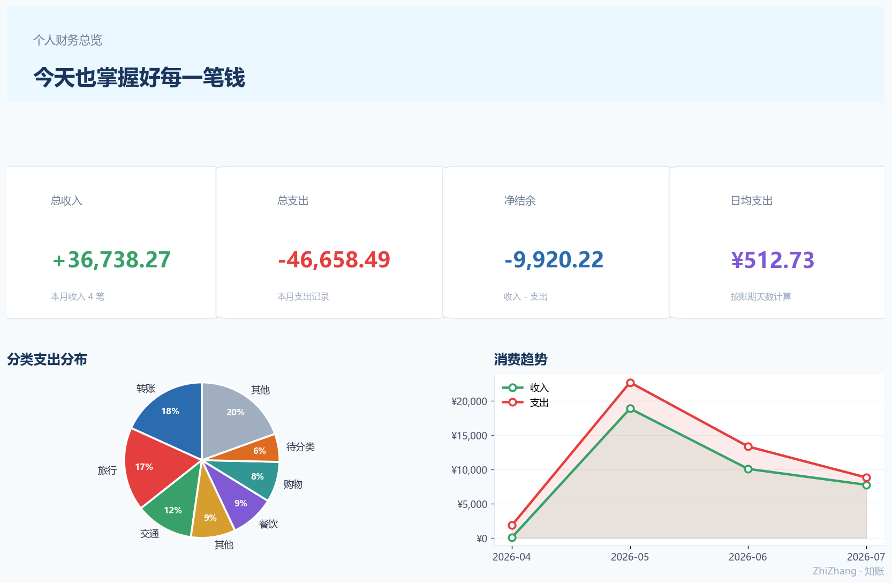
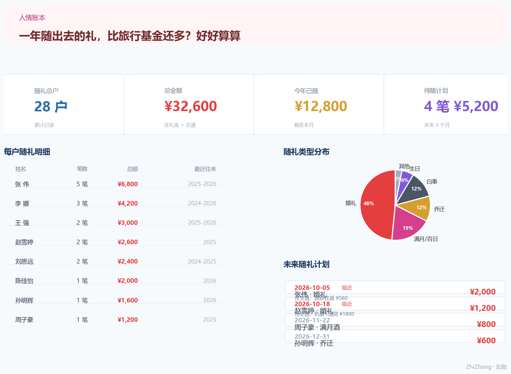
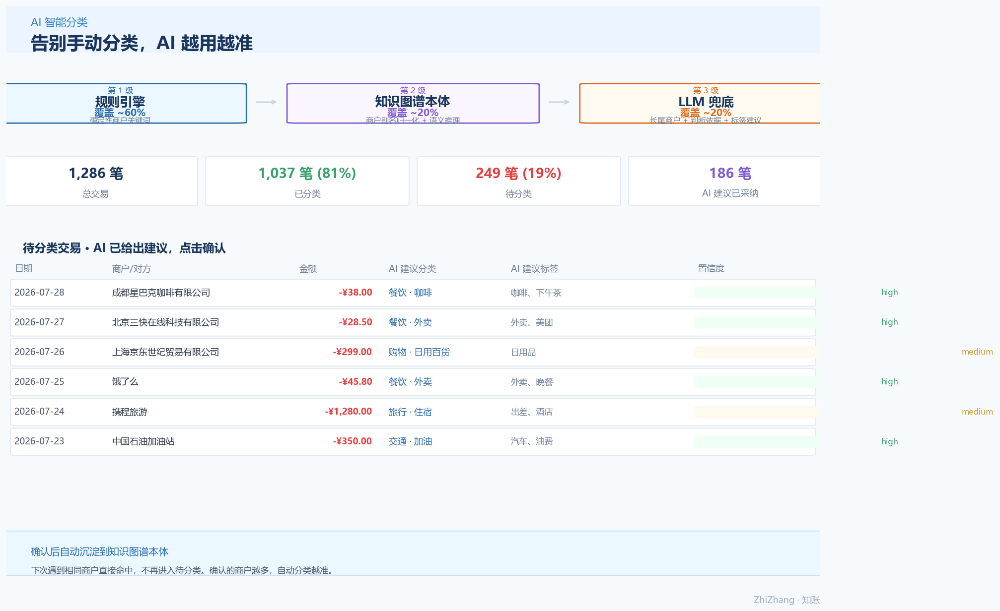

# 知账 ZhiZhang — 越用越懂你的个人财务 AI 顾问

> 别再问"钱都花哪去了"。导入账单，它自动分类；你确认一次，它记住一辈子。越用越懂你的财务助手。

[](https://www.python.org/)
[](https://flask.palletsprojects.com/)
[](https://platform.openai.com/docs/guides/function-calling)
[](agent/knowledge/)
[](LICENSE)

---

## 🎯 为什么又做了一个记账工具？

市面上的记账 App 很多，但我总在这些事上卡住：

- **「这个月份子钱又随了三千？」** — 没有一款记账工具真的在管**人情往来**，而这恰恰是 25-35 岁人群最大的"意外支出"
- **导入了账单，分类全是错的** — 商户名乱七八糟，手动分类到天荒地老
- **只会告诉你"花了多少"，不会告诉你"够不够花"** — 下个月发奖金、要交车险、要还贷款，余额能不能撑住？得自己算
- **数据全在别人服务器上** — 账单、余额、交易记录……一个比一个敏感

知账想解决这些真实问题：**本地部署、AI 自动分类、场景化财务建议、人情账本全覆盖**。

最关键的是 — **它会越用越懂你。**

你每确认一次分类、每打一个标签、每记一笔随礼，这些知识都会沉淀到本体知识图谱里。
下一次遇到类似的商户、类似的消费，它自动就知道该归到哪、该打什么标签。
用得越久，待分类越少，AI 建议越准。

而这一切的底层，是一套**本体驱动的财务知识图谱**——它不是简单的分类标签，而是真正理解"钱和谁有关、为什么花、意味着什么"。

---

## 🖼️ 一图看懂



> 一张图掌握全局：实时收支、分类构成、消费趋势、现金流预警

---

## 💡 核心亮点

### 🎁 人情账本 — 专门解决"随礼"这件大事

| 功能 | 说明 |
| --- | --- |
| 按人聚合 | 记不清给谁随过多少？搜一下全出来，总额 / 笔数 / 明细一目了然 |
| 类型统计 | 婚礼 / 满月 / 乔迁 / 白事…… 分门别类，看看每年人情开销占工资多少 |
| 未来随礼计划 | 知道 10 月份有两场婚礼？记进去，临近 7 天自动提醒，提前预留预算 |
| 交通费用 | 不仅是礼金，来回车票、住宿一并计入，看清一次随礼的真实成本 |

> 对很多人来说，一年随出去的礼可能比旅行基金还多。这笔账，值得好好算。



### 🧠 本体驱动的财务知识图谱 — 不只是打标签，是真正理解你的钱

知账的核心不是"记了多少账"，而是**理解了多少财务关系**。

我们用**本体（Ontology）** 构建了一套个人财务领域的语义模型：商户、分类、账户、标签、人、交易…… 它们之间不是孤立的字符串，而是有类型、有层级、有关联的实体。

**这意味着什么？**

- 当你看到"北京三快在线科技有限公司"，它知道这是**美团**，归入**餐饮外卖** — 这是**商户归一化**
- 当你在"星巴克"消费，它不仅知道是"餐饮"，还能推理出是"咖啡"、"下午茶"场景 — 这是**语义推理**
- 当你给"张伟"随了 2000 块礼金，这笔交易同时关联了**商户（婚礼酒店）+ 分类（人情支出）+ 人（张伟）+ 事件（婚礼）** — 这是**多维度关联**
- 当你确认了一笔 AI 分类，新的商户实例和分类关系自动写回知识图谱，下次直接命中 — 这是**自我进化**

**本体层（TBox）** 定义了"什么是商户、什么是分类、它们之间有什么关系"；
**实例层（ABox）** 沉淀了你所有确认过的真实商户、别名、分类关联，越用越准。

> 这不是简单的规则匹配，而是让系统真正"认识"你的财务世界。
> 你确认一次，它记住一辈子 — **越用越懂你。**

### 🤖 AI 财务顾问 — 不只是"你花了多少"，而是"你该怎么花"

基于 **LLM Agent + Function Calling**，知账能根据你的真实数据回答场景化问题：

- *"我下个月有一笔 1 万块奖金到账，想和女朋友出去旅行一趟，预算控制在多少比较合适？"*
- *"年底要交 8000 块车险，现在开始每个月存多少够？"*
- *"我现在的储蓄进度，按这个花钱速度，年底能攒够 3 万吗？"*
- *"这个月在餐饮上超支了多少？主要花在哪几家？"*

**AI 不会瞎编答案** — 它会自主调用你的交易数据、固定收支、储蓄目标、负债计划，经过真实计算后给出结论，每一笔都有据可查。

而知识图谱让 AI 的回答更聪明：它不再只会"查金额"，而是能基于商户的分类层级、标签关联、人物关系做更深层的推理。
你用得越久，知识图谱越丰富，AI 就越懂你的消费习惯。

### 🏷️ 三级智能分类 — 告别手动记账

导入微信 / 支付宝 / 银行账单后，自动完成分类和打标，识别准确率从高到低分三级：

1. **规则引擎** — 确定性商户关键词（京东→购物、星巴克→餐饮），秒级匹配，覆盖 ~60%
2. **知识图谱本体** — 商户别名归一化 + 语义推理，"北京三快""美团点评"自动归到美团，覆盖 ~20%
3. **LLM 兜底** — 长尾商户交给大模型，附判断依据和推荐标签，一键确认后自动沉淀到本体，覆盖 ~20%

> 787 笔真实账单测试：待分类从 224 笔降到 171 笔，仍在持续优化。
> 用得越久，待分类越少 — 这是一个会自己成长的分类系统。



### 💰 现金流预测 — 提前 12 个月看见你的余额

结合**历史消费均值 + 固定收支 + 负债分期 + 储蓄计划**，生成未来 12 个月的逐月流水表：

- 余额低于安全线自动标红预警
- 大额支出月份提前标注
- 模拟"如果涨薪 20% 会怎样"、"如果多存 500/月呢"等场景（规划中）

---

## 🚀 完整功能矩阵

### 账单与分类

| 功能 | 状态 | 说明 |
| --- | --- | --- |
| 多源账单导入 | ✅ | 微信 / 支付宝 / 银行 TSV、PDF 银行流水（MinerU 解析）、Excel 财务计划 |
| 跨渠道去重 | ✅ | 银行侧快捷支付（财付通/支付宝）自动识别为重复记录 |
| 三级自动分类 | ✅ | 规则引擎 → 知识图谱本体 → LLM 兜底，置信度分级 |
| 待分类工作台 | ✅ | 单笔/批量分类、一键应用同商户规则、AI 建议 |
| 分类规则自学习 | ✅ | 每次确认后写回规则库与本体，越用越聪明 |
| 标签系统 | ✅ | 自定义标签、交易打标、按标签统计 |

### 分析与预测

| 功能 | 状态 |
| --- | --- |
| 月度收支汇总 / 分类占比 / 商户排行 | ✅ |
| 消费趋势（折线图 + 环比分析） | ✅ |
| 现金流预测（未来 12 个月） | ✅ |
| 固定收支 & 分期付款管理 | ✅ |
| 负债管理（贷款/利率/还款计划） | ✅ |
| 储蓄目标进度跟踪 | ✅ |
| 理财账户（本金/市值/收益率） | ✅ |
| 收入确认（预计到账/逾期提醒） | ✅ |
| 全局账期筛选 | ✅ |

### 特色模块

| 功能 | 状态 |
| --- | --- |
| 🎁 人情账本（随礼管理） | ✅ |
| 🧠 本体知识图谱（TBox + ABox + 推理） | ✅ |
| 💬 AI 自然语言财务问答 | ✅ |
| 🔔 智能提醒（待分类/待还款/待收入/即将随礼） | ✅ |
| 🏦 多账户管理 + 余额重算 | ✅ |
| 💾 数据库备份 / 恢复 | ✅ |
| 🌐 Web 仪表盘 + ⌨️ CLI 双端 | ✅ |

### Roadmap

- [ ] 🎯 预算管理（总预算/分类预算/超支预警）
- [ ] 👨👩👧 家庭财务空间（成员协作、分摊规则）
- [ ] 🧠 财务健康度评分（储蓄率、负债压力、应急金覆盖）
- [ ] 🎤 语音记账
- [ ] 📦 模板社区
- [ ] ☁️ 多端同步
- [ ] 🔍 基于知识图谱的智能搜索（"我去年给婚礼随了多少礼"）

---

## 🧠 系统架构

```
┌─────────────────────────────────────────────────────────────┐
│                       交互层                                   │
│    Web 仪表盘 (Flask + Chart.js)      CLI 终端 (Rich)          │
└────────────────────────────┬────────────────────────────────┘
                             │ REST API / 直接调用
┌────────────────────────────▼────────────────────────────────┐
│                   Agent 核心层 (agent.py)                    │
│    LLM 对话循环 + 工具调度（OpenAI SDK，兼容 DeepSeek 等）       │
│    「财务助手」系统提示词 + 最多 5 轮 Function Calling 循环       │
└────────────────────────────┬────────────────────────────────┘
                             │ TOOL_SCHEMAS（9 个工具）
┌────────────────────────────▼────────────────────────────────┐
│                    工具层 (tools.py)                          │
│  查询：月度汇总 / 分类占比 / 交易查询 / 消费趋势 / 商户排行 / 预测 │
│  执行：批量分类 / 批量打标签（写库 + 规则自学习 + 本体沉淀）       │
└────────────────────────────┬────────────────────────────────┘
                             │
┌────────────────────────────▼────────────────────────────────┐
│                   分析层 (analyzer.py)                       │
│    纯函数式统计：去重过滤 → 汇总 → 分类 → 趋势 → 预测             │
└────────────────────────────┬────────────────────────────────┘
                             │
┌───────────────┬────────────┴──────────────┬─────────────────┐
│   数据加载层    │      持久化层              │   文档解析        │
│ (data_loader)  │  (SQLite: database.py)    │  (MinerU)        │
│ 微信/支付宝/银行 │ 交易/账户/负债/储蓄/理财    │ PDF 银行流水      │
│ 统一 Transaction│ 分类规则/标签/分期/提醒     │ Excel 财务计划表  │
└───────┬───────┴─────────────┬─────────────┴────────┬────────┘
        │  商户解析            │  知识沉淀              │  语义推理
        ▼                     ▼                      ▼
┌───────────────────────────────────────────────────────────┐
│                知识图谱层 (agent/knowledge/)                │
│                                                              │
│  ┌──────────────────────────────────────────────────────┐  │
│  │  模式层 TBox  (ontology.yaml)                        │  │
│  │  · 类：Merchant / Category / Account / Person / Tag  │  │
│  │  · 关系：belongs_to / alias_of / located_in ...      │  │
│  │  · 属性：merchant_name / category_level / ...        │  │
│  └───────────────────────┬──────────────────────────────┘  │
│                          │  实例化                            │
│  ┌───────────────────────▼──────────────────────────────┐  │
│  │  实例层 ABox  (instances.yaml)                       │  │
│  │  · 商户实例 + 别名 + 分类关联（持续增长）              │  │
│  │  · 自动从用户确认中沉淀，零人工维护                   │  │
│  └───────────────────────┬──────────────────────────────┘  │
│                          │  推理                              │
│  ┌───────────────────────▼──────────────────────────────┐  │
│  │  推理层  (query.py)                                  │  │
│  │  · resolve_merchant：商户别名归一化                    │  │
│  │  · get_category：基于本体的分类推理                    │  │
│  │  · upsert_merchant：实例写回 & 知识沉淀                │  │
│  └──────────────────────────────────────────────────────┘  │
└───────────────────────────────────────────────────────────┘
```

**设计要点**

- **分层解耦**：数据加载 / 分析 / 工具 / Agent / Web 各层职责单一，分析层为纯函数，便于单元测试
- **Agent 与数据分离**：LLM 只负责决策工具调用，所有数据计算由确定性代码完成，回答可追溯、可复现
- **规则 + 本体 + LLM 三级分类链路**：确定性规则兜底，本体语义归一化处理长尾，LLM 处理最后一公里
- **写入工具带确认机制**：批量分类/打标前先查询确认商户与笔数，避免误操作
- **知识图谱自进化**：每一次用户确认的分类、每一个新增的标签，都会自动写回本体实例层，系统越用越聪明
- **TBox/ABox 分离**：本体模式（概念与关系）与实例（具体商户与分类）彻底解耦，模式层稳定，实例层随用户数据持续生长

---

## 🛠️ 技术栈

| 类别 | 技术 |
| --- | --- |
| 语言 | Python 3.11+ |
| AI Agent | OpenAI SDK（Function Calling，兼容 DeepSeek / Qwen / GLM 等） |
| 知识图谱 | 自研本体（TBox/ABox 分离，YAML 持久化，纯 Python 推理） |
| Web | Flask + Jinja2 + Chart.js（原生 JS，零前端框架依赖） |
| 存储 | SQLite（WAL 模式，支持备份/恢复） |
| CLI | Rich（表格、面板、Markdown 渲染） |
| 文档解析 | MinerU（PDF / Excel / 图片 → Markdown / JSON） |
| 数据源 | 微信支付、支付宝、银行账单（TSV / PDF / XLSX） |

---

## ⚡ 快速开始

```bash
# 1. 克隆项目
git clone https://github.com/evamardin/ZhiZhang-.git
cd ZhiZhang-

# 2. 安装依赖
pip install -r requirements.txt

# 3. 配置 LLM（可选，不配也能用，只是没有 AI 问答）
# 方式一：环境变量
export DEEPSEEK_API_KEY="sk-xxx"        # Windows: $env:DEEPSEEK_API_KEY="sk-xxx"
# 方式二：编辑 agent/config.json 中的 llm.api_key

# 4. 启动 Web 应用
python agent/web/app.py
# 打开 http://127.0.0.1:5000

# 5. 或使用 CLI
python agent/main.py
```

### 自然语言示例（Web / CLI）

- *"我这个月花了多少钱？"*
- *"在星巴克一共花了多少？"*
- *"最近三个月消费趋势怎么样？"*
- *"下个月我的余额还够用吗？"*
- *"把所有星巴克的交易都设为餐饮分类"*
- *"给所有咖啡消费加个'咖啡'标签"*

---

## 📁 目录结构

```
ZhiZhang-/
├── agent/                    # 核心代码
│   ├── agent.py              # LLM Agent：对话循环 + 工具调度
│   ├── analyzer.py           # 财务分析层（纯函数）
│   ├── tools.py              # 工具定义（Function Calling Schema + 执行）
│   ├── data_loader.py        # 多源账单解析 + 统一交易模型
│   ├── config.py             # 配置管理
│   ├── main.py               # CLI 入口
│   ├── knowledge/            # 知识图谱 / 本体（核心）
│   │   ├── ontology.yaml     # 模式层 TBox：类、关系、属性定义
│   │   ├── instances.yaml    # 实例层 ABox：商户、别名、分类关联（持续生长）
│   │   ├── query.py          # 推理层：归一化、分类、写回
│   │   └── demo.py           # 演示脚本
│   └── web/                  # Flask Web 应用
│       ├── app.py            # REST API + 页面路由
│       ├── database.py       # SQLite 持久化层
│       ├── templates/        # Jinja2 页面模板
│       └── static/           # CSS / JS
├── docs/
│   └── screenshots/          # 演示截图
├── 工具/                     # MinerU / DeepSeek 辅助工具（不含密钥）
├── 个人财务助手需求文档.md      # 完整需求规格说明
├── 知识图谱设计方案.md          # 本体模块详细设计文档
└── requirements.txt
```

---

## 🔒 隐私优先

本项目处理的是**高度敏感的个人财务数据**，从设计上重视隐私：

- **100% 本地运行**：数据存在你自己的 SQLite 数据库里，不上传任何服务器
- **AI 调用可选**：不配置 API Key 也能使用全部手动功能，AI 问答按需开启
- **敏感数据全忽略**：`.gitignore` 已配置账单原始文件、数据库、配置文件等全部忽略
- **演示请用脱敏数据**：截图或分享前，请务必替换为脱敏后的示例数据

---

## 📄 License

[MIT](LICENSE)
